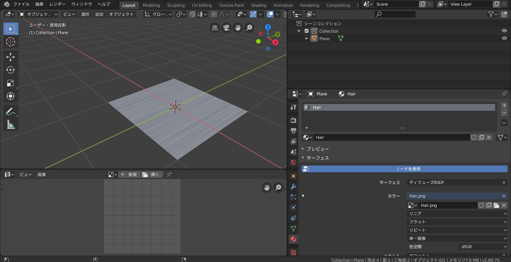
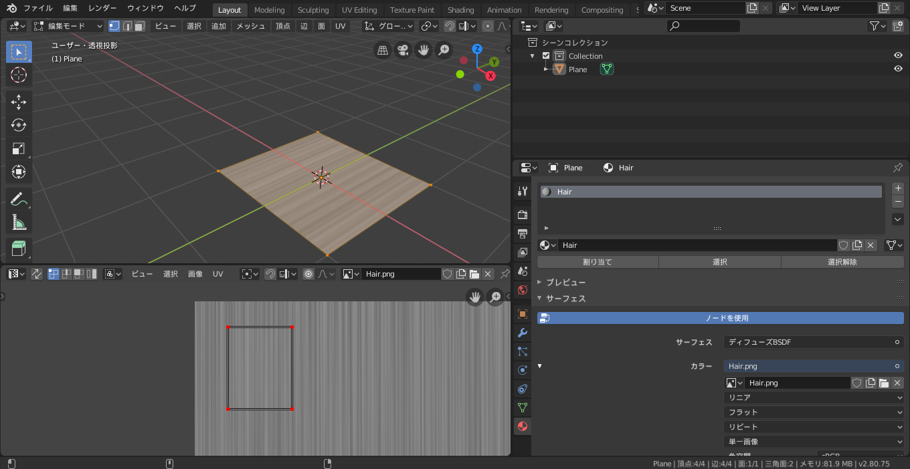
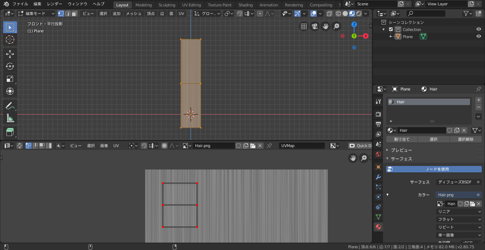
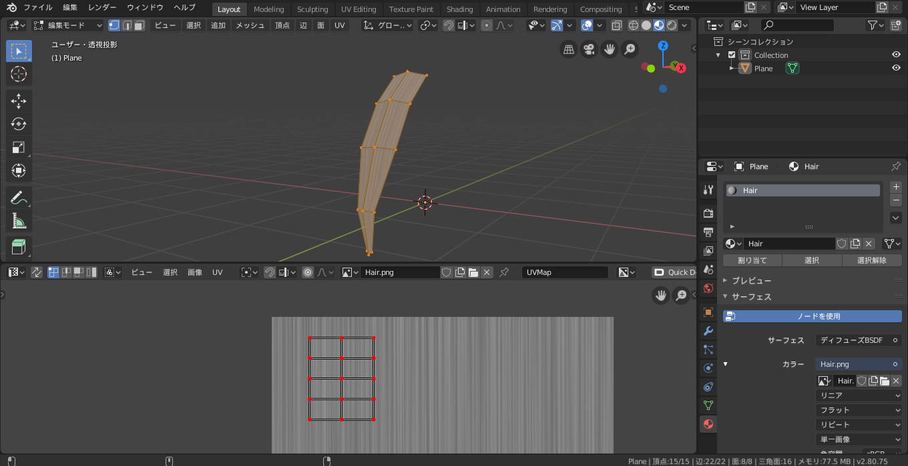
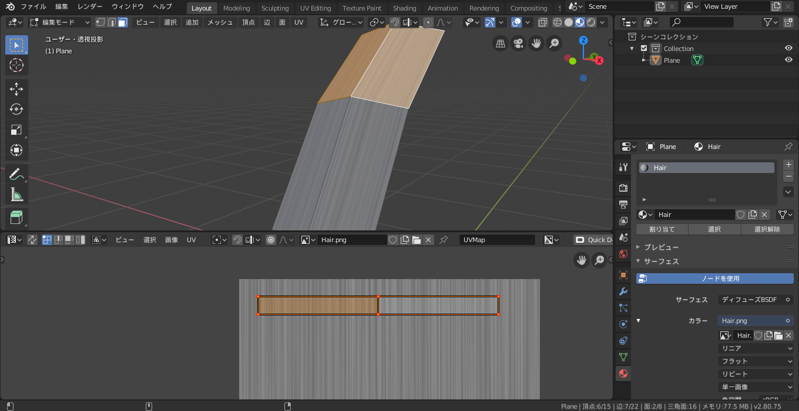
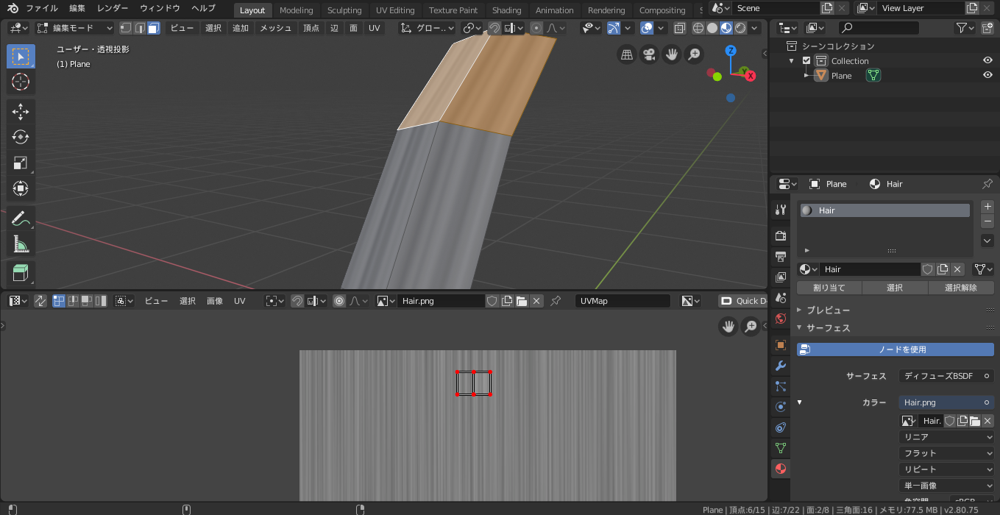
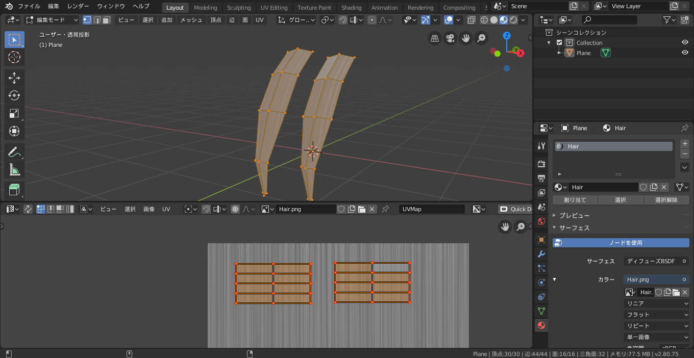

---
type = 'post'
title = '髪のモデリングはUV展開を先にやると楽'
description = '髪のモデリング手法の提案'
post_date = 2019-08-31T12:29:49.6430690+09:00
tags = ["3DCG", "Blender"]
---

髪のモデリング手法の一例

## 環境
+ Blender 2.8

## 目次
1. 髪のテクスチャを用意する
1. Planeを作りマテリアルを設定し、髪のテクスチャを指定する
1. UVを固定
1. 押し出しではなくカットでポリゴンを割る
1. 複製する

## 髪のテクスチャを用意する
絵柄にこだわりがなければ次のようなテクスチャにするのが良いかと思います。

これは一面グレーのテクスチャにノイズを散らして上下に引き伸ばすことで作っています。

## Planeを作りマテリアルを設定し、髪のテクスチャを指定する
次の画像の通りです。

## UVの固定
この時点でUVを固定してしまいます。
比較的メッシュがシンプルな段階でUVを固定しておくことで、後にメッシュを分割してもUVの形を綺麗に保つことができます。

## 押し出しではなくカットでポリゴンを割る
ここから造形をしていくのですが、その際に押し出し（E）を使わないことが重要になります。
次の画像はカット（ループカットなど）を用いた場合です。UVの形を変えずにポリゴンを割ることができています。

押し出しで造形をする場合、UV上で新たに生まれた頂点と元からあった頂点が重なってしまうため少し手間です。
（これについて覚えがあるのではないでしょうか？ 私はあります）

1つ注意点をあげると、毛先を尖らせたいからといって三角面にしないことです。UVの綺麗さを保つために四角形のまま頂点を近づけることで毛先を表現すると良いです。

この順番でモデリングを行うと後の改変が楽になります。

例えば、毛束の密度をもっと上げたいといったとき、次のようにUV上でX軸方向に引き伸ばすだけで満足します。（画像では見やすいように一部のUVしか写ってませんが、全体を引き伸ばしています）

また、その逆も可能です。しかしUVを小さくするとぼやけるのでテクスチャの解像度と相談しましょう。

以上のように毛束を作ります。

## 複製する
毛束を増やしていきます。
このとき、作りたい束が既にあるものと形があからさまに異なるのでなければ、複製（Shift+D）によってこれを増やすのをおすすめします。

次の画像のようにUVも複製されるので、ある束は同じ領域に重ねることで同じ見た目にし、ある束はテクスチャの別の部分を適用させ……、なんてことが容易になります。

## ア

説明に用いたBlederファイルは配布します。
[how_to_hair.zip](how_to_hair.zip)

この手法が有効なシーンは髪にモデリングに限りません。一般にUVはシンプルな段階で展開しきっておくことで後の作業が容易になる直感があります。